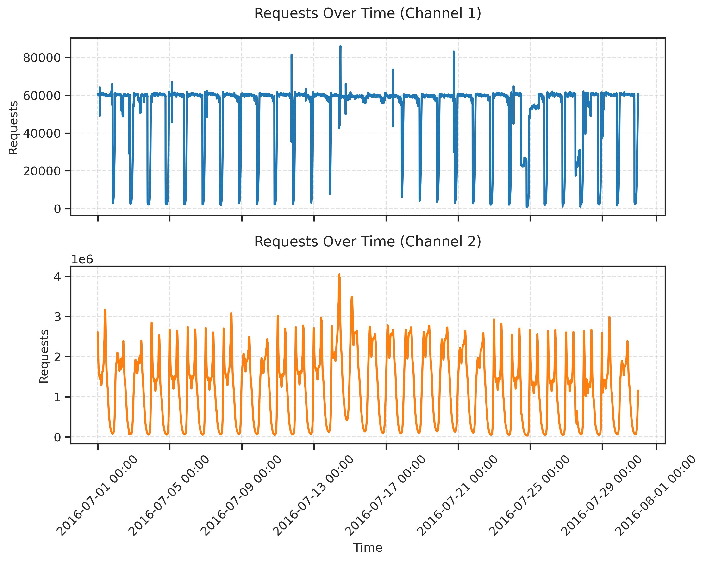

Authors [William Toner](https://github.com/WToner/) and [Thomas Lee](https://github.com/Tlee43)

# Performance of Zero-Shot Time Series Foundation Models on Cloud Data

This repository contains a curated dataset used in our workshop paper [**"Performance of Zero-Shot Time Series Foundation Models on Cloud Data."**](https://arxiv.org/pdf/2502.12944?) The dataset is derived from [sir-lab's repository](https://github.com/sir-lab), with preprocessing applied to focus on the most informative channels.

## Dataset Overview

- **Source**: Adapted from sir-lab's cloud data repository.
- **Time Resolution**: Requests have been aggregated into **5-minute bins**.
- **Time Axis**: The dates given on the x-axis are not the true dates for the dataset but a randomly selected 30 days in 2016
- **Duration**: Covers **30 days** (8640 timestamps per series).
- **Regions**: The original dataset contained 5 regions. We excluded **region 3** due to low request volume and uninformative channels.
- **Channel Selection**:
  - Retained channels with the highest request counts.
  - Removed near-duplicate channels to ensure diversity.
- **Processing**: All filtering and aggregation were completed **before** any model evaluations. Users are encouraged to explore different channels from the [original dataset](https://github.com/sir-lab).

## Data Format  

The processed dataset is available in the `/data` directory as zipped archives. Each datacentre's data is stored in a separate `.zip` file, which needs to be extracted before use:  

```
/data
  ├── datacentre_1.zip
  ├── datacentre_2.zip
  ├── datacentre_3.zip
  ├── datacentre_4.zip
```

After unzipping, one should aim for a structure like this:  
```
/data
  ├── datacentre_1.csv
  ├── datacentre_2.csv
  ├── datacentre_3.csv
  ├── datacentre_4.csv
```

Each CSV file contains time-series data with timestamps as rows and different request channels as columns.

## Usage

To load and visualise the data, refer to `example_plots.py`, which provides basic functionality for:
- Loading the CSVs into Pandas DataFrames
- Plotting selected channels

Example usage:

```python
import pandas as pd
import matplotlib.pyplot as plt

df = pd.read_csv("data/datacentre_1.csv", index_col=0, parse_dates=True)
column1 = df.columns[0]
df[column1].plot()
plt.show()
```



## Citation

If you use this dataset in your work, please cite our workshop paper:

> "[Performance of Zero-Shot Time Series Foundation Models on Cloud Data](https://arxiv.org/pdf/2502.12944?)," William Toner, Tom Lee, _'I Can't Believe it's Not Better'_ ICLR 2025.
---

For any questions or feedback, feel free to open an issue or reach out!
